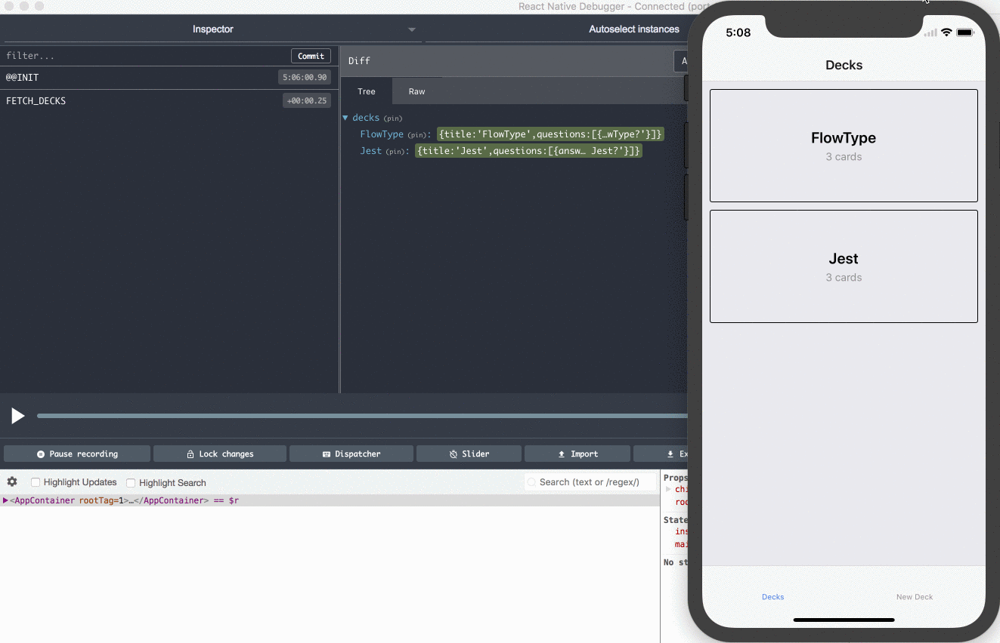

1. How to install

```sh
$ git clone https://github.com/soosap/udacity-cards.git
$ yarn install
```

2. How to run
```sh
$ yarn start
```

3. Technology used
- react-native
- redux
- styled-components
- flowtype
- ramda

4. Tested devices

The app is compatible on iOS as well as android devices. The styles, however, have been optimized for iOS. A platform dependent fine-tuning of the styles would be a nice addition to the project. See how you can contribute right below.

5. How to contribute

In order to contribute checkout the repository, create a feature branch, contribute code, test it and finally make a pull request into the master branch. I will review your work and merge it if it meets the standards.

Contributions are welcome.
